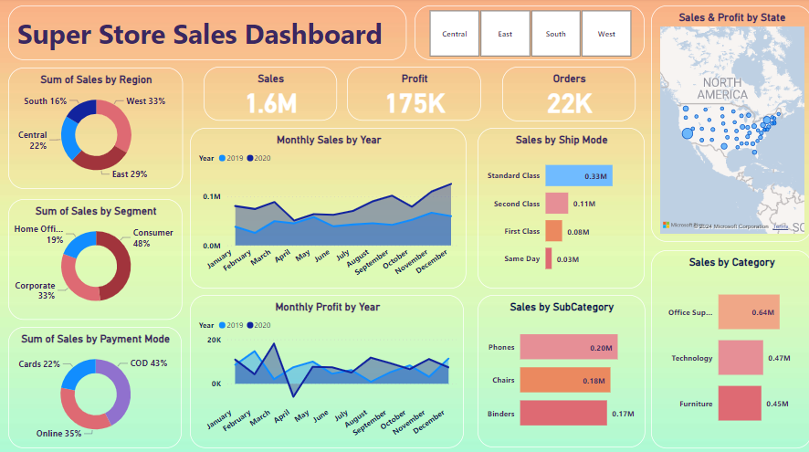
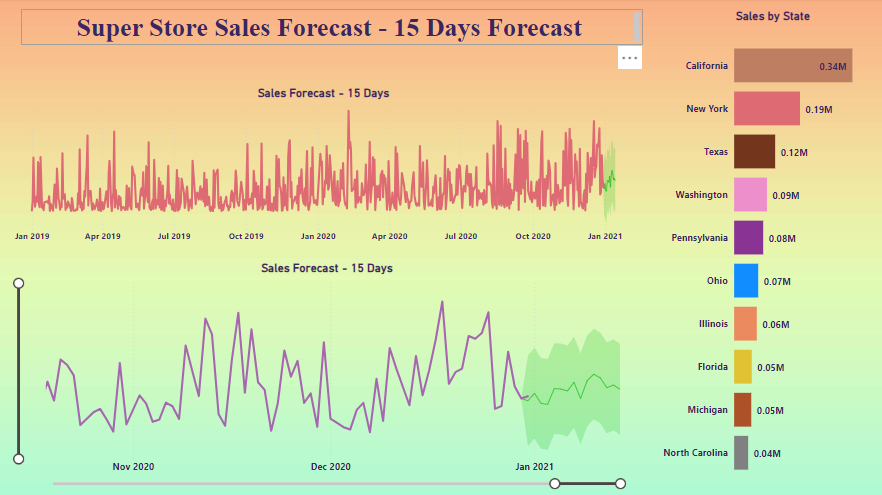

# Power-Bi-Sales-Dashboard
The Super Store Sales Dashboard powered by Power BI offers a comprehensive view of sales performance, enabling businesses to make data-driven decisions and drive growth. With intuitive visualizations and interactive features, this dashboard provides valuable insights into sales trends, product performance, customer behavior, and more.

# SuperStore Sales Dashboard

Welcome to the SuperStore Sales Dashboard repository! This repository contains a Power BI dashboard created to analyze sales data from the SuperStore_Sales_Dataset. With this dashboard, you can gain insights into various aspects of the SuperStore's sales performance.


## Getting Started

To get started, follow these simple steps:

1. **Clone the Repository:** Clone this repository to your local machine using the following command:
    ```
   [ git clone https://github.com/SowmiahNadar/Power-Bi-Sales-Dashboard.git]
    ```

2. **Download the SuperStore Sales Dataset:** You need the SuperStore Sales Dataset to create the dashboard. You can download it from [here](https://github.com/SowmiahNadar/Power-Bi-Sales-Dashboard/blob/ec1a33daa2d72fc39d40d1407a5fde2271412ef9/SuperStore_Sales_Dataset.csv). Make sure to place the dataset file in the appropriate directory within the cloned repository.

3. **Open the Power BI File:** Once you have the dataset, open the `SuperStore Sales Dashboard.pbix` file using Power BI Desktop.

4. **Connect the Dataset:** In Power BI Desktop, connect to the SuperStore Sales Dataset that you downloaded in step 2.

5. **Explore the Dashboard:** Now that you've connected the dataset, you can explore the dashboard. Navigate through the different tabs and visuals to gain insights into SuperStore's sales performance.

## Dashboard Components



The SuperStore Sales Dashboard consists of the following components:

- **Sales Overview:** Provides an overview of sales performance over time.
- **Category Analysis:** Analyzes sales by product category.
- **Region Analysis:** Examines sales performance across different regions.
- **Customer Insights:** Offers insights into customer behavior and purchasing patterns.
- **Product Performance:** Highlights the performance of individual products.




The 15-Day Forecast feature within the Super Store Power BI Dashboard:
- Visualize forecasted sales data through interactive charts for easy interpretation.
- Display confidence intervals around forecasted values to assess reliability.
- Explore different scenarios by adjusting variables to understand potential impacts.
- Automatically update forecasts with new sales data for relevance.
- Provide actionable insights for decision-making, including inventory planning and resource allocation.
- Seamlessly integrate forecasted sales data with operational systems for streamlined decision-making processes.

## Contributing

If you find any issues or have suggestions for improvements, feel free to open an issue or create a pull request. Your contributions are highly appreciated!

## License

This project is licensed under the MIT License - see the [LICENSE](LICENSE) file for details.

## Acknowledgments

Special thanks to [Power BI](https://powerbi.microsoft.com/) for providing an excellent platform for data visualization and analysis.

Author: [Sowmiah_Nadar](https://neuralthread.cloud/sowmiah)

Happy analyzing! If you have any questions or need further assistance, don't hesitate to reach out.
